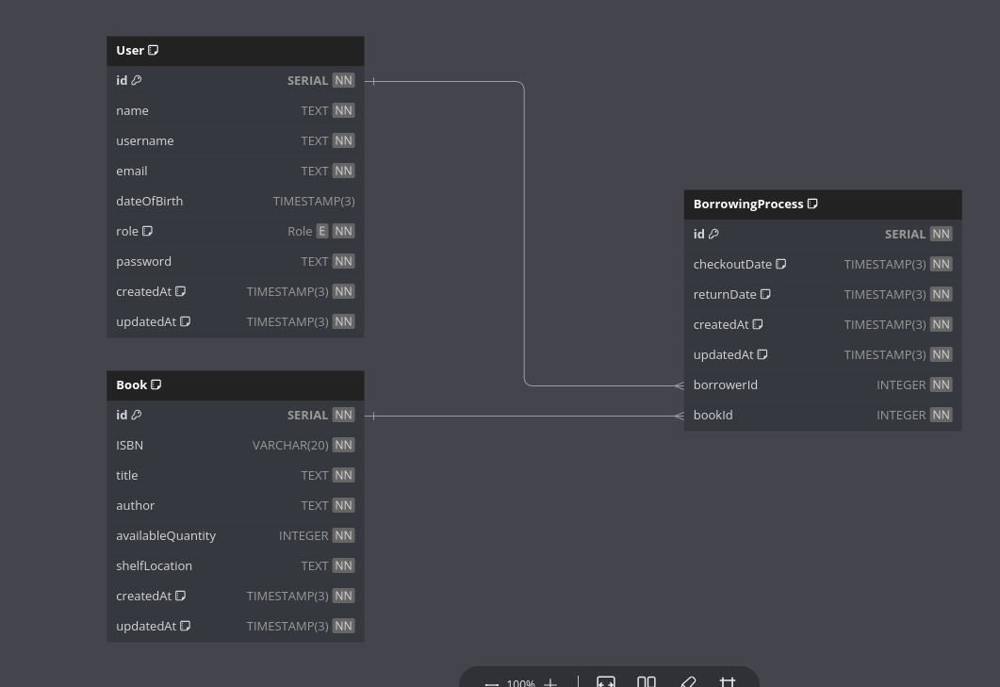

## Important!

Before starting, install docker-compose to your machine and start docker containers:

```bash
$ docker-compose up
```

## Environment

- need create .env file
- example: .example.env

## Run locally

### Required:

node.js: v21.0.0

Install dependencies:

```shell
yarn
```

Now create a file called `.env` in the project root and add the following variables, replacing the values with your own or you can see .env.example file.

**.env**

```env
NODE_ENV=production
PORT=5500
DATABASE_URL="postgresql://postgres:P@ssw0rd@db:5432/myapp"
JWT_SECRET="JWT_SECRET_JWT_SECRET"
JWT_EXPIRES_IN="1d"
```

Run the project:

```shell
yarn start:deploy
```

Run the project tests:

```shell
yarn test
```

## Schema Diagram

<p align="center">
    
</p>

## Documentation

[Documentation] -> (/api/docs)
