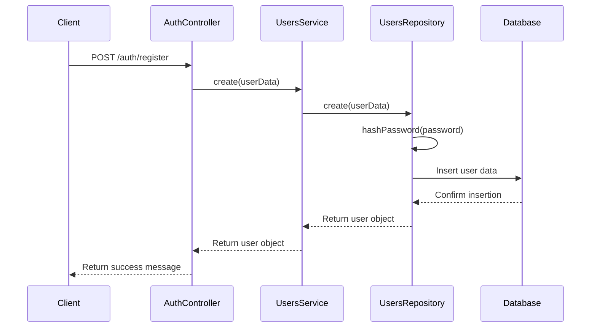
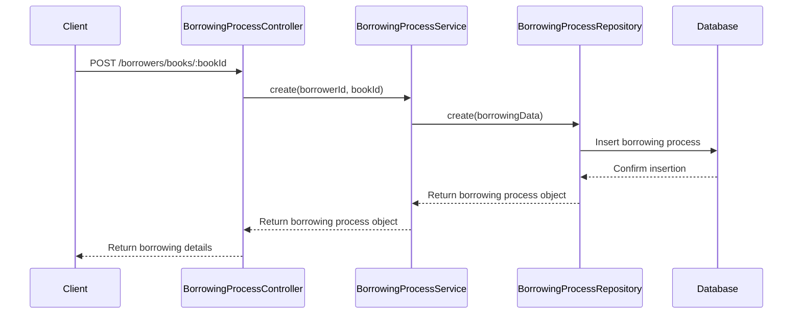

# Library Management System

## Project Description

The Library Management System is a comprehensive web application designed to streamline the operations of a library. It provides an efficient platform for managing books, users, and borrowing processes. The system aims to simplify tasks such as book cataloging, user management, and tracking borrowed books, enhancing the overall library experience for both staff and patrons.

## Tech Stack

- **Backend Framework**: NestJS
- **Database**: PostgreSQL
- **ORM**: Prisma
- **Authentication**: JWT (JSON Web Tokens)
- **API Documentation**: Swagger
- **Testing**: Jest
- **Containerization**: Docker
- **CI/CD**: GitHub Actions
- **Dependency Management**: Yarn
- **Language**: TypeScript

## Project Architecture

The project follows a modular architecture based on NestJS's module system:

1. **App Module**: The root module that ties together all other modules.
2. **Users Module**: Handles user-related operations and authentication.
3. **Books Module**: Manages book-related operations.
4. **Borrowers Module**: Handles the borrowing process.
5. **Auth Module**: Manages authentication and authorization.
6. **Database Module**: Handles database connections and operations using Prisma.
7. **Health Module**: Provides health check endpoints for the application.

The application uses a layered architecture within each module:
- Controllers: Handle HTTP requests and responses.
- Services: Contain business logic.
- Repositories: Interface with the database using Prisma.

## Project Structure

```
.
├── src/
│   ├── auth/                 # Authentication related files
│   ├── books/                # Book management module
│   ├── borrowers/            # Borrowing process management
│   ├── core/                 # Core utilities and shared components
│   ├── database/             # Database configuration and service
│   ├── health/               # Health check module
│   ├── tasks/                # Scheduled tasks
│   ├── users/                # User management module
│   ├── utils/                # Utility functions
│   ├── app.module.ts         # Main application module
│   └── main.ts               # Application entry point
├── test/                     # End-to-end tests
├── prisma/                   # Prisma schema and migrations
├── .github/                  # GitHub Actions workflows
├── docker-compose.yml        # Docker Compose configuration
├── Dockerfile                # Docker configuration for the app
├── .env.example              # Example environment variables
└── package.json              # Project dependencies and scripts
```

## Features

1. **User Management**
   - User registration and authentication
   - Role-based access control (Admin and User roles)
   - Profile management (update profile, change password, change email)

2. **Book Management**
   - Add new books to the library
   - Search for books by title, author, or ISBN
   - Update book information
   - View book availability

3. **Borrowing Process**
   - Borrow books
   - Return books
   - View borrowing history

4. **Admin Features**
   - Manage user accounts
   - Manage book inventory
   - Generate reports

5. **API Documentation**
   - Swagger UI for API exploration and testing

## Sequence Diagrams

### User Registration



### Book Borrowing Process



## Database Schema

Below is a visual representation of our database schema:

[Database Schema]


This schema illustrates the relationships between the main entities in our system: User, Book, and BorrowingProcess. It also shows the fields for each entity and the relationships between them.

For a more detailed view of the schema, including data types and constraints, please refer to the `prisma/schema.prisma` file in the project root.

## Getting Started

### Prerequisites

- Node.js (v21.0.0)
- Docker and docker-compose
- Yarn package manager

### Setup

1. Clone the repository:
   ```
   git clone https://github.com/ahmdhusam/library-management-system.git
   cd library-management-system
   ```

2. Install dependencies:
   ```
   yarn install
   ```

3. Set up environment variables:
   - Copy `.env.example` to `.env`
   - Fill in the required values in `.env`

4. Start the Docker containers:
   ```
   docker-compose up -d
   ```

5. Run database migrations:
   ```
   yarn prisma migrate deploy
   ```

6. Start the application:
   ```
   yarn start:dev
   ```

The application should now be running on `http://localhost:3000`.

### Running Tests

To run the test suite:

```
yarn test
```

### API Documentation

Once the application is running, you can access the Swagger UI documentation at:

```
http://localhost:3000/api/docs
```

## License

This project is licensed under the MIT License.